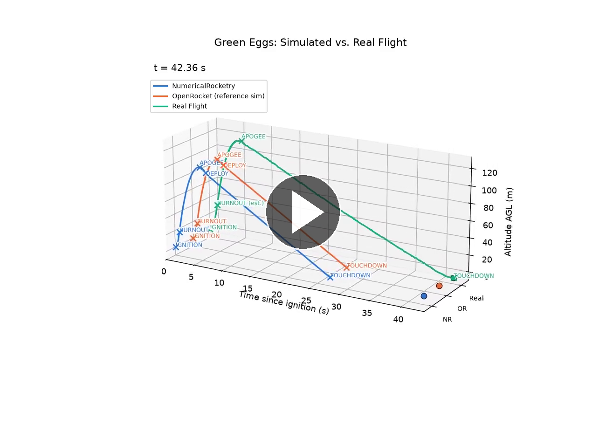
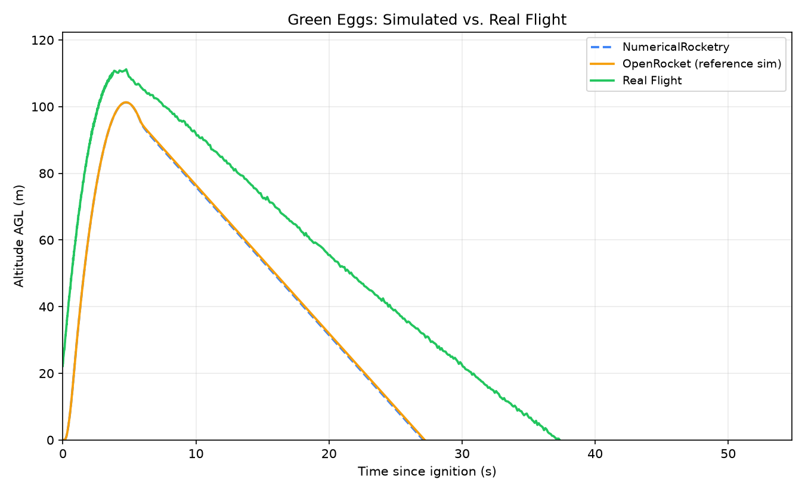

# NumericalRocketry

[](LICENSE)


A standalone Python 6DOF rocket flight simulator built to reproduce OpenRocket’s simulation results for one specific real rocket, “Green Eggs”, flying a real Estes C11-5 motor.

This isn't a general-purpose simulator: the geometry, mass table, and motor are hardcoded for this one design. The goal is an independent Python reimplementation of the rocket-flight physics used by OpenRocket, developed by studying its open-source implementation and validating the results against OpenRocket. It's a personal/research project and learning exercise.

## Table of contents

* [Background](#background)
* [Results](#results)
* [Getting started](#getting-started)
* [Usage](#usage)
* [Project structure](#project-structure)
* [License](#license)

## Background

This project started as an honors contract requirement for MAT-2 (Differential Equations). Since the dawn of the space age, numerical methods have played a defining role in rocket development by enabling engineers to model trajectories long before physical testing. Many governing equations in flight dynamics simply lack closed-form solutions, which is exactly the kind of case numerical methods exist for. This project applies those same numerical techniques to small-scale rocket flight. It extends a previously verified 1D ascent simulator, preserved and adapted with this rocket's real geometry in [`legacy/`](legacy/), into a full 3D Python-based flight simulation with explicit geometry, event-aware dynamics, and atmospheric modeling.

The rotational and translational equations of motion are integrated with a fixed-stage RK4 scheme (`k1`-`k4` per step) combined with adaptive step-size control. The step size shrinks around ignition, burnout, and other fast-changing-force events, then grows during smoother coasting instead of using a single fixed `dt` for the whole flight.

**Accuracy gain from the full 3D rewrite.** Run head-to-head on this same rocket and motor, the 1D model's own RK4 branch gets apogee within 2.00% of OpenRocket's reference simulation (99.27 m vs. 101.29 m), a reasonable result for a model with no attitude dynamics, no exact Barrowman CP/stability treatment, and a simplified drag model. This project's full 6DOF result closes about 99.5% of that remaining gap, landing within 0.01% of OpenRocket, roughly a 200× reduction in apogee error. Unlike the 1D model, it produces a stability margin, off-axis motion, and a modeled recovery/descent phase at all. Full breakdown, plots, and how each integrator does individually in [`legacy/COMPARISON.md`](legacy/COMPARISON.md).

The full project abstract is in [`docs/26th Annual Building Bridges Research Conference Abstract - Boula Etans.pdf`](docs/26th%20Annual%20Building%20Bridges%20Research%20Conference%20Abstract%20-%20Boula%20Etans.pdf).

## Results

Three versions of the same flight, compared on a shared timeline: this project's own simulation, OpenRocket's own simulation of the identical rocket/motor/conditions, and the real flight-computer log from the actual launch.

[](https://github.com/user-attachments/assets/eec7af9f-b41b-4994-86a0-9f0fbf17c71a)

Click the image above to play the animation (60fps). The source file is versioned in the repo at [`assets/flight_comparison.mp4`](assets/flight_comparison.mp4) and regenerated by `animate_flight_comparison.py`; the play link points to a separate copy uploaded to GitHub's attachment CDN, since GitHub only renders a playable video from that CDN, not from a file committed directly to the repo.

Quick look, no animation required:



**Interactive version.** **[Open the interactive version](https://htmlpreview.github.io/?https://github.com/boulaetans/numericalrocketry/blob/main/assets/flight_comparison_interactive.html)**, which renders [`assets/flight_comparison_interactive.html`](assets/flight_comparison_interactive.html) live in the browser via [htmlpreview.github.io](https://htmlpreview.github.io), a free proxy for viewing a raw HTML file hosted on GitHub without downloading it. It has the same data, but with draggable zoom/pan, hover tooltips showing exact values, and click-to-toggle lines in the legend. This link only works once the file is pushed to the public repo; until then, download the file and open it locally instead (this also works fully offline; regenerate with `plot_flight_comparison_interactive.py`).

|              | NumericalRocketry (sim)  | OpenRocket (reference sim) | Real Flight (logged)      |
| ------------ | ------------------------ | --------------------------- | -------------------------- |
| Apogee       | t = 4.77 s, 101.30 m AGL | t = 4.77 s, 101.29 m AGL    | t = 6.06 s, 115.67 m AGL   |
| Max velocity | 45.5 m/s                 | 45.5 m/s                    | 42.4 m/s *(re-derived, see note)* |
| Touchdown    | t = 27.12 s              | t = 27.19 s                 | t = 42.36 s *(corrected, see note)* |

**Real-flight log corrections.** The raw log required correction before it was usable, not just read as-is. The EasyMini board used for this flight is barometer-only (no accelerometer), and checking it directly against the raw samples found three issues: the computed ground elevation was wrong by 24.5 m (it used a fixed standard-atmosphere pressure reference rather than the day's real pressure), 66 rows were exact duplicate artifacts, and the onboard `boost`/`coast`/`main`/`landed` state labels did not line up with true ignition or touchdown. All three are corrected directly in the CSV: ground elevation is solved by least-squares fit against the actual pressure data, duplicate rows are removed, and `state_name` is corrected at ignition (t=0) and landed (the point where acceleration/speed actually settle, rather than the flag's much-delayed timestamp). The full method is documented in [`data/derive_real_flight_csv.py`](data/derive_real_flight_csv.py), which rebuilds the CSV from the raw EasyMini export end to end.

**Velocity re-derivation.** The real flight's max velocity in the table above is re-derived, not the onboard value. The EasyMini has no accelerometer, so its own `acceleration`/`speed` columns are a real-time Kalman filter's estimate from pressure alone. A real-time filter cannot see future samples, so it measurably lags during the fastest part of the flight: integrating the onboard speed under-predicts the real height gained during boost by about 17%, and that gap stops growing once boost ends. Re-deriving speed/acceleration offline, using a forward Kalman filter and a backward RTS smoother that is not limited to past-only data, closes most of that gap: 42.4 m/s versus the onboard log's originally reported 35.4 m/s, against a simulated 45.5 m/s. The first 0.3 seconds of boost remain the roughest part of this re-derivation, since the sensor's own noise there is close in size to the true motion and no amount of retuning fully separates the two; treat that stretch as the least certain part of the real-flight curve.

**Apogee gap.** The real flight's apogee reads about 12.42% higher than either simulation. A single real flight diverging from simulation by a few percent, sometimes more, is a common outcome in amateur rocketry validation and not a red flag by itself: individual motors vary batch to batch within certification tolerance, an as-built rocket rarely masses exactly what its design file specifies, and launch-day atmospheric conditions are never quite the standard atmosphere both simulations assume. One real flight is a single noisy sample, not a controlled repeat measurement.

This project's own simulator and OpenRocket, two independently built physics engines, agree with each other to within 0.01%. For a shared modeling error to explain the real-flight gap, both would have to be wrong by about 12.42% in the same direction, which is unlikely. The gap more plausibly comes from having only one real flight and one set of sensor data; the pressure sensor's own limitations, described above, are a demonstrated contributor. A barometric altimeter is also specifically prone to dynamic-pressure error: a fast-moving rocket creates a local low-pressure region at the sensor's port (a Bernoulli effect), which a low-cost altimeter can misread as extra altitude, especially at higher speeds and in the same direction as observed here. There is nothing to fix in the simulator based on this result; it is a real-world finding about the limits of a low-cost flight computer, not a simulator bug.

**Touchdown timing.** The real flight's touchdown came roughly 56% later than either simulation (about 42 s versus about 27 s), even though apogee time and altitude are close across all three. Two verified, partial contributors: the real flight's onboard descent rate varies between about -1.8 and -4.2 m/s over time (confirmed directly in the raw sensor data, not a smoothing artifact), consistent with the rocket swinging under the parachute or wind gusts affecting descent, while both simulations assume a steady terminal velocity; and the real landing site sits about 3 m below the launch pad's elevation (the flight computer's height reading settles around -3 m rather than 0 m after landing), so the real rocket had slightly farther to fall than either simulation, which assumes touchdown back at launch elevation. The elevation difference accounts for under a second of the total gap on its own; the larger remaining difference is most plausibly parachute-drag and descent-rate modeling, which is worth investigating further if descent modeling becomes a focus later.

### Simulation accuracy vs. OpenRocket

These are the apogee, peak velocity, and touchdown results compared directly with OpenRocket's simulation of the same rocket, motor, and conditions.

| Metric          | NumericalRocketry | OpenRocket | Gap                |
| --------------- | ----------------- | ---------- | ------------------ |
| Apogee altitude | 101.30 m          | 101.29 m   | +0.01 m (0.01%)    |
| Apogee time     | 4.7663 s          | 4.766 s    | ~1 ms              |
| Max velocity    | 45.53 m/s         | 45.53 m/s  | ~0.005 m/s (0.01%) |
| Touchdown       | 27.116 s          | 27.194 s   | -0.08 s (0.29%)    |

Every event, including internal validation metrics such as rail clear, recovery deploy, liftoff mass, and CG, is in [`data/RESULTS.md`](data/RESULTS.md).

## Getting started

### Prerequisites

Python 3.10+.

### Installation

```sh
git clone https://github.com/boulaetans/numericalrocketry.git
cd numericalrocketry
python -m venv .venv
.venv\Scripts\activate          # Windows
# source .venv/bin/activate     # macOS/Linux
pip install -r requirements.txt
```

## Usage

Run the simulation:

```sh
python run_simulation.py
```

Prints the mission-event timeline and writes `data/Green Eggs NumericalRocketry Flight.csv`.

Regenerate the 3D comparison animation:

```sh
python animate_flight_comparison.py
```

Writes `assets/flight_comparison.mp4` by default, rendered natively at 60fps via FFMpegWriter.

| Flag                 | Default                        | Meaning                                                                             |
| -------------------- | ------------------------------ | ----------------------------------------------------------------------------------- |
| `--output`           | `assets/flight_comparison.mp4` | Output file path                                                                    |
| `--fps`              | `60`                           | Frames per second                                                                   |
| `--playback-seconds` | real time                      | How long the main sweep takes to play (defaults to actual flight duration, ~42.4 s) |
| `--hold-seconds`     | `3.0`                          | Pause after the last touchdown before the animation ends                            |

Regenerate the static comparison plot:

```sh
python plot_flight_comparison.py
```

Writes `assets/flight_comparison.png` by default (`--output` to change it).

## Project structure

```text
numericalrocketry/
├── numericalrocketry/           # the simulator package
│   ├── constants.py                # shared physical constants
│   ├── rocket/                     # the vehicle definition
│   │   ├── rocket_config.py          # Green Eggs' geometry/mass table, motor path, recovery params
│   │   ├── geometry.py                # RocketGeometry, nose profile integration, fin geometry, shape-integrated CG
│   │   ├── mass_model.py              # ComponentMassModel (dynamic CG/inertia)
│   │   ├── propulsion.py              # .eng motor file loading, thrust curve, mass depletion
│   │   └── recovery.py                # Parachute deployment config
│   ├── physics/                    # the physics models
│   │   ├── atmosphere.py              # ISA atmosphere model
│   │   ├── gravity.py                 # WGS84 gravity model
│   │   ├── drag.py                    # Drag model (skin friction, pressure, base, wave)
│   │   ├── aerodynamics.py            # Barrowman CN/CP, damping moments, the core aero physics
│   │   ├── dynamics.py                # Rigid-body force/moment -> state derivative
│   │   └── quaternion.py              # Quaternion math (exponential-map integration)
│   ├── simulation/                 # the run loop
│   │   ├── integrator.py              # RK4 time-marching loop, adaptive timestep
│   │   └── state.py                   # Simulation state dataclasses
│   └── motors/
│       └── Estes_C11.eng             # RASP motor data (thrust curve, mass)
├── data/                         # reference/input data (.ork design file, all three flight logs) + RESULTS.md (full data table)
│   ├── Green Eggs Real Flight Raw.csv          # raw EasyMini export, untouched
│   ├── Green Eggs Real Flight.csv             # rebuilt/corrected real-flight log (see derive_real_flight_csv.py)
│   ├── Green Eggs OpenRocket Flight.csv       # OpenRocket's own simulation export (reference)
│   ├── Green Eggs NumericalRocketry Flight.csv  # this project's own simulation output (git-ignored, regenerated by run_simulation.py)
│   ├── Green Eggs OpenRocket.ork               # the OpenRocket design file both simulations are built from
│   └── derive_real_flight_csv.py               # rebuilds the real-flight CSV above from the raw export, fully documented
├── assets/                       # the comparison MP4 (+ thumbnail), static plot, and interactive HTML
├── docs/                         # the project abstract
├── legacy/                       # the original 1D numerical-methods simulator this project grew from
│   ├── legacy_1d_simulator.py      # Euler / ABM-2 / RK4 comparison, adapted with Green Eggs' real geometry
│   └── COMPARISON.md               # how the 1D model stacks up against the rest of the project
├── run_simulation.py             # entry point: runs the 6DOF simulation
├── animate_flight_comparison.py  # entry point: generates the 3-way comparison animation (MP4)
├── plot_flight_comparison.py     # entry point: generates the static comparison plot
├── plot_flight_comparison_interactive.py  # entry point: generates the zoomable HTML version
└── requirements.txt
```

## License

Distributed under the MIT License. See [`LICENSE`](LICENSE) for details.
