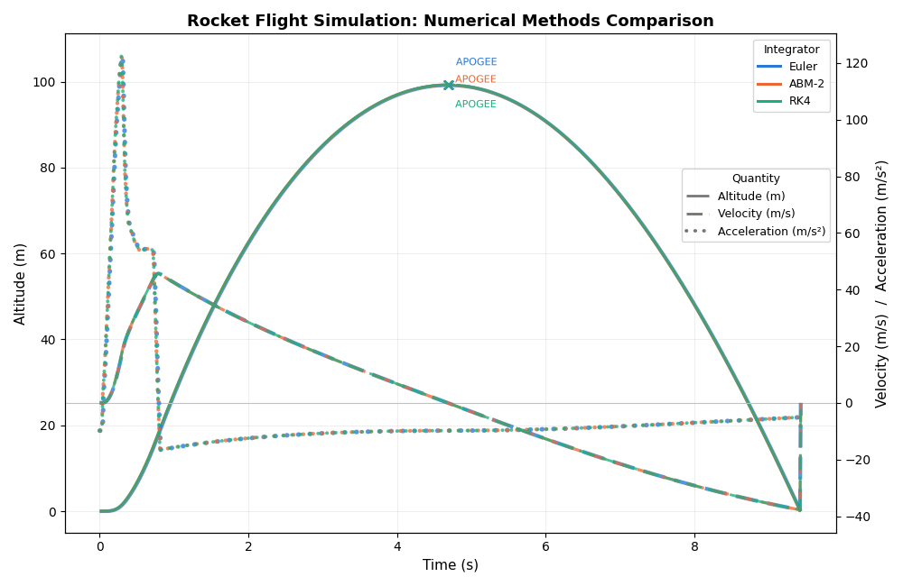

# Comparison: original 1D model vs. this project

Supplemental to the main [README](../README.md): how far the project's own predecessor, a
1D ascent-only numerical-methods comparison (`legacy_1d_simulator.py`, adapted here with Green
Eggs' real geometry and motor; see that file's docstring for exactly what changed), gets on
its own, next to the full 6DOF project it grew into and the two references the main README
validates against.

Ascent-only metrics, since the 1D model has no recovery system and free-falls under drag after
apogee. Its descent isn't a fair comparison to anything else here, so it's left out (see
`legacy_1d_simulator.py`'s docstring).

| | Euler (1D) | ABM-2 (1D) | RK4 (1D) | NumericalRocketry (6DOF) | OpenRocket | Real Flight |
| --- | --- | --- | --- | --- | --- | --- |
| Apogee altitude | 99.18 m | 99.23 m | 99.27 m | 101.30 m | 101.29 m | 115.67 m |
| Time to apogee | 4.69 s | 4.68 s | 4.68 s | 4.77 s | 4.77 s | 6.06 s |
| Max velocity | 45.66 m/s | 45.63 m/s | 45.64 m/s | 45.53 m/s | 45.53 m/s | 42.35 m/s *(re-derived, see README note)* |

A few things worth noticing:

* **The three 1D integrators land within 0.1% of each other** (99.18 to 99.27 m), with Euler furthest off and RK4 closest to the full 6DOF result: exactly the accuracy ordering the original comparison set out to demonstrate. The numerical-method choice matters far less here than the physics model underneath it.
* **The 1D model's RK4 apogee (99.27 m) is within 2.00% of OpenRocket's reference simulation (101.29 m)**, despite having no attitude dynamics, no exact Barrowman CP/stability treatment, and a simplified drag model: a reasonable showing for a model this much simpler. The full 6DOF project (101.30 m) cuts that same gap to 0.01% (see the main README's head-to-head), on top of adding a stability margin, off-axis motion, and a modeled recovery/descent phase the 1D model has no way to represent.
* **Max velocity across all three simulated models (1D and 6DOF alike) agrees to within ~0.3%.** Peak velocity happens right at burnout, driven almost entirely by thrust and mass, which is the part of the flight where the extra fidelity matters least.



**Interactive version.** **[Open the interactive version](https://htmlpreview.github.io/?https://github.com/boulaetans/numericalrocketry/blob/main/legacy/comparison_interactive.html)**, which renders [`comparison_interactive.html`](comparison_interactive.html) live in the browser via [htmlpreview.github.io](https://htmlpreview.github.io), a free proxy for viewing a raw HTML file hosted on GitHub without downloading it. It has the same data, but with draggable zoom/pan, hover tooltips showing exact values, and click-to-toggle lines in the legend. This link only works once the file is pushed to the public repo; until then, download the file and open it locally instead (this also works fully offline).

Regenerate the 1D numbers:
```sh
.venv\Scripts\python.exe legacy/legacy_1d_simulator.py
```
Writes `comparison.png` and `comparison_interactive.html` into `legacy/` and prints the metrics table above.
